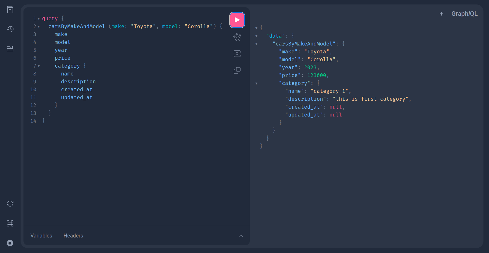

# CruiseGraphQL: Innovative Car Rental Laravel Platform

Welcome to CruiseGraphQL, an innovative car rental platform that harnesses the power of GraphQL. This project is developed using Laravel 10 and PHP 8.2, offering a streamlined approach to car reservations, real-time vehicle availability tracking, and optimized performance through Redis caching.

CruiseGraphQL is an innovative car rental platform leveraging GraphQL. Engineered using Laravel 10 and PHP 8.2, it streamlines car reservations, monitors vehicle availability, and employs Redis caching for enhanced performance.

## Features

- **Car Rental Simplified:** CruiseGraphQL provides a user-friendly experience for browsing and renting cars.
- **Effortless Booking Management:** Users can easily create, modify, and manage their car rental bookings.
- **Real-time Vehicle Availability:** The system ensures up-to-date information on car availability.
- **GraphQL API:** CruiseGraphQL exposes a GraphQL API for flexible queries and mutations.
- **Enhanced Performance:** Redis caching is implemented to optimize data retrieval and reduce database load.
- **Laravel 10 and PHP 8.2:** Built on the latest technologies to ensure a modern and robust foundation.

## Installation

Clone the repository from GitHub.

```bash
git clone https://github.com/BaseMax/CruiseLaravelGraphQL.git
```

Navigate to the project directory.

```bash
cd CruiseLaravelGraphQL
```

Install project dependencies using Composer.

```bash
composer install
```

Duplicate `.env.example` and rename the copy to `.env`.

```bash
cp .env.example .env
```

Configure `.env` with your database and Redis settings.

Run database migrations and seeders to set up the initial database structure and sample data.

```bash
php artisan migrate
```

Start the development server.

```bash
php artisan serve
```

Run unit tests:

```bash
php artisan test
```

Access the GraphQL Playground at `http://localhost:8000/graphiql` in your web browser.

## GraphQL API

Explore and interact with the CruiseGraphQL API using the integrated GraphQL Playground. Test various queries and mutations to experience the platform's capabilities firsthand.

Here are some examples:

Query available cars:

```graphql
query {
  availableCars {
    id
    make
    model
    year
    ...
  }
}
```

Create a booking:

```graphql
mutation {
  createBooking(input: {
    userId: 1,
    carId: 3,
    pickupDate: "2023-08-20",
    returnDate: "2023-08-25"
  }) {
    id
    user {
      name
    }
    car {
      make
      model
    }
    ...
  }
}
```

## GraphQL

| Query/Mutation      | Description                                                       | Example |
|--------------------|-------------------------------------------------------------------|---------|
| `availableCars`    | Fetch a list of available cars.                                   | `query { availableCars { id make model year ... } }` |
| `car`              | Get details of a specific car by ID.                              | `query { car(id: 1) { id make model year ... } }` |
| `user`             | Retrieve details of a user by ID.                                 | `query { user(id: 2) { id name email ... } }` |
| `booking`          | Fetch details of a booking by ID.                                 | `query { booking(id: 5) { id user { name } car { make model } ... } }` |
| `userBookings`     | Get a list of bookings made by a specific user.                  | `query { userBookings(userId: 3) { id car { make model } ... } }` |
| `createBooking`    | Create a new booking.                                             | `mutation { createBooking(input: { userId: 4 carId: 7 pickupDate: "2023-08-20" returnDate: "2023-08-25" }) { id user { name } car { make model } ... } }` |
| `updateBooking`    | Update an existing booking.                                       | `mutation { updateBooking(id: 8 input: { pickupDate: "2023-09-01" }) { id pickupDate returnDate ... } }` |
| `cancelBooking`    | Cancel a booking.                                                 | `mutation { cancelBooking(id: 10) }` |
| `carCategories`    | Retrieve a list of available car categories.                      | `query { carCategories { id name description ... } }` |
| `carCategory`      | Get details of a specific car category by ID.                     | `query { carCategory(id: 3) { id name description ... } }` |
| `addCar`           | Add a new car to the system.                                      | `mutation { addCar(input: { make: "Toyota" model: "Corolla" year: 2023 ... }) { id make model ... } }` |
| `updateCar`        | Update car details.                                               | `mutation { updateCar(id: 5 input: { year: 2022 }) { id make model ... } }` |
| `deleteCar`        | Remove a car from the system.                                     | `mutation { deleteCar(id: 7) }` |
| `addUser`          | Register a new user.                                              | `mutation { addUser(input: { name: "John Doe" email: "john@example.com" ... }) { id name email ... } }` |
| `updateUser`       | Update user details.                                              | `mutation { updateUser(id: 9 input: { name: "Jane Smith" }) { id name email ... } }` |
| `deleteUser`       | Remove a user from the system.                                    | `mutation { deleteUser(id: 11) }` |
| `addCarCategory`   | Add a new car category.                                           | `mutation { addCarCategory(input: { name: "SUV" description: "Sport Utility Vehicle" ... }) { id name description ... } }` |
| `updateCarCategory`| Update car category details.                                      | `mutation { updateCarCategory(id: 13 input: { description: "All-terrain vehicles" }) { id name description ... } }` |
| `deleteCarCategory`| Remove a car category from the system.                            | `mutation { deleteCarCategory(id: 15) }` |
| `userLogin`        | Authenticate a user.                                              | `mutation { userLogin(email: "john@example.com" password: "securepassword") { token user { name } ... } }` |
| `userLogout`       | Log out a user.                                                   | `mutation { userLogout }` |
| `allBookings`      | Fetch a paginated list of all bookings.                           | `query { allBookings(page: 2, perPage: 10) { totalPerPage currentPage lastPage data { id user { name } car { make model } ... } } }` |
| `searchCars`       | Search for cars based on specific criteria.                       | `query { searchCars(keyword: "SUV", year: 2022) { id make model year ... } }` |
| `bookingsByStatus` | Retrieve bookings based on their status.                          | `query { bookingsByStatus(status: "pending") { id user { name } car { make model } ... } }` |
| `totalRevenue`     | Calculate the total revenue generated from bookings.              | `query { totalRevenue }` |
| `cancelBooking`    | Cancel a booking.                                                 | `mutation { cancelBooking(id: 17) }` |
| `userDashboard`    | Fetch a user's dashboard statistics.                              | `query { userDashboard(userId: 6) { totalBookings upcomingBookings revenue ... } }` |
| `carAvailability`  | Check the availability of a specific car for a given time period. | `query { carAvailability(carId: 9 startDate: "2023-09-01" endDate: "2023-09-10") }` |
| `extendBooking`    | Extend the return date of a booking.                              | `mutation { extendBooking(id: 19 newReturnDate: "2023-09-15") { id returnDate ... } }` |
| `mostPopularCars`  | Get a list of the most popular cars based on booking frequency.   | `query { mostPopularCars(limit: 5) { id make model bookingCount ... } }` |
| `topUsers`         | Retrieve the top users with the highest number of bookings.       | `query { topUsers(limit: 3) { id name totalBookings ... } }` |
| `bookingsByCar`        | Fetch all bookings for a specific car.                            | `query { bookingsByCar(carId: 12) { id user { name } pickupDate returnDate ... } }` |
| `carsByCategory`       | Get a list of cars belonging to a specific category.              | `query { carsByCategory(categoryId: 4) { id make model ... } }` |
| `totalBookingsByUser`   | Count the total number of bookings made by a specific user.       | `query { totalBookingsByUser(userId: 8) }` |
| `userLastBooking`      | Retrieve the last booking made by a user.                         | `query { userLastBooking(userId: 10) { id car { make model } ... } }` |
| `carDetailsWithBookings`| Get car details along with their associated bookings.            | `query { carDetailsWithBookings(carId: 15) { id make model bookings { id pickupDate returnDate ... } } }` |
| `bookingsBetweenDates` | Fetch bookings that fall within a specific date range.            | `query { bookingsBetweenDates(startDate: "2023-09-01" endDate: "2023-09-15") { id user { name } pickupDate returnDate ... } }` |
| `deleteBooking`        | Delete a booking by ID.                                           | `mutation { deleteBooking(id: 21) }` |
| `addReview`            | Add a review for a booked car.                                    | `mutation { addReview(input: { userId: 12 carId: 18 rating: 4 reviewText: "Great experience!" }) { id rating reviewText ... } }` |
| `userReviews`          | Retrieve reviews submitted by a user.                             | `query { userReviews(userId: 14) { id car { make model } rating reviewText ... } }` |
| `averageRatingForCar`  | Calculate the average rating for a specific car.                  | `query { averageRatingForCar(carId: 20) }` |
| `highestRevenueCars`   | Get a list of cars with the highest revenue generated.            | `query { highestRevenueCars(limit: 3) { id make model revenue ... } }` |
| `upcomingBookings`     | Fetch upcoming bookings for a specific user.                      | `query { upcomingBookings(userId: 16) { id car { make model } pickupDate returnDate ... } }` |
| `recentlyAddedCars`     | Retrieve a list of recently added cars.                           | `query { recentlyAddedCars(limit: 5) { id make model year ... } }` |
| `bookingByUserAndCar`   | Fetch a specific booking made by a user for a particular car.    | `query { bookingByUserAndCar(userId: 18 carId: 25) { id user { name } car { make model } ... } }` |
| `mostActiveUsers`       | Get a list of the most active users based on booking count.      | `query { mostActiveUsers(limit: 10) { id name totalBookings ... } }` |
| `carsWithReviews`       | Retrieve cars along with their associated reviews.               | `query { carsWithReviews(limit: 10) { id make model reviews { id user { name } rating ... } } }` |
| `availableCarCategories`| Fetch a list of currently available car categories.              | `query { availableCarCategories { id name description ... } }` |
| `carCategoryCars`       | Get a list of cars belonging to a specific car category.          | `query { carCategoryCars(categoryId: 7) { id make model ... } }` |
| `userTotalSpent`        | Calculate the total amount spent by a specific user on bookings. | `query { userTotalSpent(userId: 20) }` |
| `userReviewsWithCars`   | Retrieve user reviews along with the corresponding car details.  | `query { userReviewsWithCars(userId: 22) { id rating reviewText car { make model ... } } }` |
| `bookingsWithReviews`   | Get bookings along with their associated reviews.                | `query { bookingsWithReviews(limit: 5) { id user { name } car { make model } reviews { rating reviewText ... } } }` |
| `highestRatedCars`      | Fetch cars with the highest average ratings.                     | `query { highestRatedCars(limit: 3) { id make model averageRating ... } }` |
| `carsByMakeAndModel`    | Search for cars based on make and model.                         | `query { carsByMakeAndModel(make: "Honda", model: "Civic") { id year ... } }` |
| `bookingsByDate`        | Retrieve bookings made on a specific date.                       | `query { bookingsByDate(date: "2023-09-15") { id user { name } car { make model } ... } }` |
| `earliestBooking`       | Fetch the earliest booking made by a user.                       | `query { earliestBooking(userId: 24) { id car { make model } pickupDate returnDate ... } }` |
| `bookingsWithUserAndCar`| Get bookings along with their associated user and car details.  | `query { bookingsWithUserAndCar(limit: 5) { id user { name email } car { make model } ... } }` |
| `carsByYear`            | Retrieve cars based on a specific manufacturing year.             | `query { carsByYear(year: 2022) { id make model ... } }` |
| `bookingDetails`        | Fetch detailed information about a specific booking.             | `query { bookingDetails(id: 27) { id user { name email } car { make model } pickupDate returnDate ... } }` |
| `userByEmail`           | Retrieve user details using their email address.                 | `query { userByEmail(email: "jane@example.com") { id name ... } }` |
| `mostBookedCar`         | Get the car that has been booked the most.                       | `query { mostBookedCar { id make model bookingCount ... } }` |
| `carsByPriceRange`      | Search for cars within a specific price range.                   | `query { carsByPriceRange(minPrice: 500, maxPrice: 1000) { id make model price ... } }` |
| `bookingsInMonth`       | Retrieve bookings made within a specific month.                  | `query { bookingsInMonth(year: 2023, month: 8) { id user { name } car { make model } ... } }` |
| `userBookedCars`        | Fetch a list of cars that a user has booked.                     | `query { userBookedCars(userId: 26) { id make model ... } }` |
| `carCategoryDetails`    | Get detailed information about a specific car category.           | `query { carCategoryDetails(categoryId: 9) { id name description ... } }` |
| `bookingRevenue`        | Calculate the total revenue generated from a booking.            | `query { bookingRevenue(id: 29) }` |
| `averageRatings`        | Get the average ratings for all cars.                            | `query { averageRatings { carId averageRating } }` |
| `upcomingBookingsByCar` | Fetch upcoming bookings for a specific car.                      | `query { upcomingBookingsByCar(carId: 31) { id user { name } pickupDate returnDate ... } }` |
| `recentlyBookedUsers`   | Retrieve a list of users who made recent bookings.               | `query { recentlyBookedUsers(limit: 5) { id name ... } }` |

## Examples





## Database Schema

### Users Table
- **id**: INTEGER (Primary Key)
- **name**: STRING
- **email**: STRING
- **password**: STRING
- **created_at**: TIMESTAMP
- **updated_at**: TIMESTAMP

### Cars Table
- **id**: INTEGER (Primary Key)
- **make**: STRING
- **model**: STRING
- **year**: INTEGER
- **price**: DECIMAL
- **category_id**: INTEGER (Foreign Key to Car Categories)
- **created_at**: TIMESTAMP
- **updated_at**: TIMESTAMP

### Car Categories Table
- **id**: INTEGER (Primary Key)
- **name**: STRING
- **description**: TEXT
- **created_at**: TIMESTAMP
- **updated_at**: TIMESTAMP

### Bookings Table
- **id**: INTEGER (Primary Key)
- **user_id**: INTEGER (Foreign Key to Users)
- **car_id**: INTEGER (Foreign Key to Cars)
- **pickup_date**: DATE
- **return_date**: DATE
- **status**: STRING (e.g., "pending", "confirmed", "canceled")
- **created_at**: TIMESTAMP
- **updated_at**: TIMESTAMP

### Reviews Table
- **id**: INTEGER (Primary Key)
- **user_id**: INTEGER (Foreign Key to Users)
- **car_id**: INTEGER (Foreign Key to Cars)
- **rating**: INTEGER
- **review_text**: TEXT
- **created_at**: TIMESTAMP
- **updated_at**: TIMESTAMP

### Car Images Table
- **id**: INTEGER (Primary Key)
- **car_id**: INTEGER (Foreign Key to Cars)
- **url**: STRING
- **created_at**: TIMESTAMP
- **updated_at**: TIMESTAMP

### Payments Table
- **id**: INTEGER (Primary Key)
- **booking_id**: INTEGER (Foreign Key to Bookings)
- **amount**: DECIMAL
- **payment_date**: DATE
- **created_at**: TIMESTAMP
- **updated_at**: TIMESTAMP

### Promotions Table
- **id**: INTEGER (Primary Key)
- **code**: STRING
- **discount_percentage**: INTEGER
- **expiry_date**: DATE
- **created_at**: TIMESTAMP
- **updated_at**: TIMESTAMP

### Addresses Table
- **id**: INTEGER (Primary Key)
- **user_id**: INTEGER (Foreign Key to Users)
- **street**: STRING
- **city**: STRING
- **state**: STRING
- **country**: STRING
- **postal_code**: STRING
- **created_at**: TIMESTAMP
- **updated_at**: TIMESTAMP

### RentalHistories Table
- **id**: INTEGER (Primary Key)
- **user_id**: INTEGER (Foreign Key to Users)
- **car_id**: INTEGER (Foreign Key to Cars)
- **pickup_date**: DATE
- **return_date**: DATE
- **created_at**: TIMESTAMP
- **updated_at**: TIMESTAMP

### CarFeatures Table
- **id**: INTEGER (Primary Key)
- **car_id**: INTEGER (Foreign Key to Cars)
- **feature**: STRING
- **created_at**: TIMESTAMP
- **updated_at**: TIMESTAMP

### MaintenanceLogs Table
- **id**: INTEGER (Primary Key)
- **car_id**: INTEGER (Foreign Key to Cars)
- **log_date**: DATE
- **description**: TEXT
- **created_at**: TIMESTAMP
- **updated_at**: TIMESTAMP

### Notifications Table
- **id**: INTEGER (Primary Key)
- **user_id**: INTEGER (Foreign Key to Users)
- **message**: TEXT
- **is_read**: BOOLEAN
- **created_at**: TIMESTAMP
- **updated_at**: TIMESTAMP

### Wishlist Table
- **id**: INTEGER (Primary Key)
- **user_id**: INTEGER (Foreign Key to Users)
- **car_id**: INTEGER (Foreign Key to Cars)
- **created_at**: TIMESTAMP
- **updated_at**: TIMESTAMP

### CarAvailability Table
- **id**: INTEGER (Primary Key)
- **car_id**: INTEGER (Foreign Key to Cars)
- **availability_date**: DATE
- **is_available**: BOOLEAN
- **created_at**: TIMESTAMP
- **updated_at**: TIMESTAMP

### CarRentals Table
- **id**: INTEGER (Primary Key)
- **user_id**: INTEGER (Foreign Key to Users)
- **car_id**: INTEGER (Foreign Key to Cars)
- **pickup_date**: DATE
- **return_date**: DATE
- **total_amount**: DECIMAL
- **status**: STRING (e.g., "active", "completed", "canceled")
- **created_at**: TIMESTAMP
- **updated_at**: TIMESTAMP

### Ratings Table
- **id**: INTEGER (Primary Key)
- **user_id**: INTEGER (Foreign Key to Users)
- **car_id**: INTEGER (Foreign Key to Cars)
- **rating**: INTEGER
- **review**: TEXT
- **created_at**: TIMESTAMP
- **updated_at**: TIMESTAMP

### Locations Table
- **id**: INTEGER (Primary Key)
- **name**: STRING
- **address**: TEXT
- **latitude**: DECIMAL
- **longitude**: DECIMAL
- **created_at**: TIMESTAMP
- **updated_at**: TIMESTAMP

### RentalRequests Table
- **id**: INTEGER (Primary Key)
- **user_id**: INTEGER (Foreign Key to Users)
- **car_category_id**: INTEGER (Foreign Key to Car Categories)
- **pickup_date**: DATE
- **return_date**: DATE
- **status**: STRING (e.g., "pending", "approved", "rejected")
- **created_at**: TIMESTAMP
- **updated_at**: TIMESTAMP

### Feedback Table
- **id**: INTEGER (Primary Key)
- **user_id**: INTEGER (Foreign Key to Users)
- **subject**: STRING
- **message**: TEXT
- **created_at**: TIMESTAMP
- **updated_at**: TIMESTAMP

### InsurancePolicies Table
- **id**: INTEGER (Primary Key)
- **name**: STRING
- **description**: TEXT
- **coverage_amount**: DECIMAL
- **premium_amount**: DECIMAL
- **created_at**: TIMESTAMP
- **updated_at**: TIMESTAMP

### CarIssues Table
- **id**: INTEGER (Primary Key)
- **car_id**: INTEGER (Foreign Key to Cars)
- **reported_by**: INTEGER (Foreign Key to Users)
- **description**: TEXT
- **status**: STRING (e.g., "reported", "in_progress", "resolved")
- **created_at**: TIMESTAMP
- **updated_at**: TIMESTAMP

### Coupons Table
- **id**: INTEGER (Primary Key)
- **code**: STRING
- **discount_amount**: DECIMAL
- **valid_from**: DATE
- **valid_until**: DATE
- **created_at**: TIMESTAMP
- **updated_at**: TIMESTAMP

### SubscriptionPlans Table
- **id**: INTEGER (Primary Key)
- **name**: STRING
- **description**: TEXT
- **price**: DECIMAL
- **features**: TEXT
- **created_at**: TIMESTAMP
- **updated_at**: TIMESTAMP

### UserSubscriptions Table
- **id**: INTEGER (Primary Key)
- **user_id**: INTEGER (Foreign Key to Users)
- **plan_id**: INTEGER (Foreign Key to SubscriptionPlans)
- **start_date**: DATE
- **end_date**: DATE
- **status**: STRING (e.g., "active", "canceled", "expired")
- **created_at**: TIMESTAMP
- **updated_at**: TIMESTAMP

### CarAccessories Table
- **id**: INTEGER (Primary Key)
- **car_id**: INTEGER (Foreign Key to Cars)
- **name**: STRING
- **description**: TEXT
- **price**: DECIMAL
- **created_at**: TIMESTAMP
- **updated_at**: TIMESTAMP

### MaintenanceServices Table
- **id**: INTEGER (Primary Key)
- **name**: STRING
- **description**: TEXT
- **cost**: DECIMAL
- **created_at**: TIMESTAMP
- **updated_at**: TIMESTAMP

### ServiceRequests Table
- **id**: INTEGER (Primary Key)
- **user_id**: INTEGER (Foreign Key to Users)
- **service_id**: INTEGER (Foreign Key to MaintenanceServices)
- **request_date**: DATE
- **status**: STRING (e.g., "requested", "in_progress", "completed")
- **created_at**: TIMESTAMP
- **updated_at**: TIMESTAMP

### UserPreferences Table
- **id**: INTEGER (Primary Key)
- **user_id**: INTEGER (Foreign Key to Users)
- **notification_enabled**: BOOLEAN
- **newsletter_subscribed**: BOOLEAN
- **theme**: STRING
- **created_at**: TIMESTAMP
- **updated_at**: TIMESTAMP

### TripLogs Table
- **id**: INTEGER (Primary Key)
- **user_id**: INTEGER (Foreign Key to Users)
- **car_id**: INTEGER (Foreign Key to Cars)
- **start_date**: DATE
- **end_date**: DATE
- **distance_traveled**: DECIMAL
- **created_at**: TIMESTAMP
- **updated_at**: TIMESTAMP

### FuelLogs Table
- **id**: INTEGER (Primary Key)
- **car_id**: INTEGER (Foreign Key to Cars)
- **log_date**: DATE
- **fuel_amount**: DECIMAL
- **fuel_price_per_unit**: DECIMAL
- **created_at**: TIMESTAMP
- **updated_at**: TIMESTAMP

### TrafficViolations Table
- **id**: INTEGER (Primary Key)
- **user_id**: INTEGER (Foreign Key to Users)
- **car_id**: INTEGER (Foreign Key to Cars)
- **violation_date**: DATE
- **description**: TEXT
- **fine_amount**: DECIMAL
- **status**: STRING (e.g., "unpaid", "paid")
- **created_at**: TIMESTAMP
- **updated_at**: TIMESTAMP

### Documents Table
- **id**: INTEGER (Primary Key)
- **user_id**: INTEGER (Foreign Key to Users)
- **document_type**: STRING
- **file_url**: STRING
- **uploaded_at**: TIMESTAMP
- **created_at**: TIMESTAMP
- **updated_at**: TIMESTAMP

### Transactions Table
- **id**: INTEGER (Primary Key)
- **user_id**: INTEGER (Foreign Key to Users)
- **amount**: DECIMAL
- **transaction_date**: DATE
- **transaction_type**: STRING (e.g., "payment", "refund")
- **status**: STRING (e.g., "completed", "pending")
- **created_at**: TIMESTAMP
- **updated_at**: TIMESTAMP

### LoyaltyPoints Table
- **id**: INTEGER (Primary Key)
- **user_id**: INTEGER (Foreign Key to Users)
- **points_balance**: INTEGER
- **created_at**: TIMESTAMP
- **updated_at**: TIMESTAMP

## Laravel Tables

### Users Table Migration (create_users_table.php):

```php
use Illuminate\Database\Migrations\Migration;
use Illuminate\Database\Schema\Blueprint;
use Illuminate\Support\Facades\Schema;

class CreateUsersTable extends Migration
{
    public function up()
    {
        Schema::create('users', function (Blueprint $table) {
            $table->id();
            $table->string('name');
            $table->string('email')->unique();
            $table->string('password');
            $table->timestamps();
        });
    }

    public function down()
    {
        Schema::dropIfExists('users');
    }
}
```

### Cars Table Migration (create_cars_table.php):

```php
use Illuminate\Database\Migrations\Migration;
use Illuminate\Database\Schema\Blueprint;
use Illuminate\Support\Facades\Schema;

class CreateCarsTable extends Migration
{
    public function up()
    {
        Schema::create('cars', function (Blueprint $table) {
            $table->id();
            $table->string('make');
            $table->string('model');
            $table->integer('year');
            $table->decimal('price', 10, 2);
            $table->unsignedBigInteger('category_id');
            $table->timestamps();

            $table->foreign('category_id')->references('id')->on('car_categories');
        });
    }

    public function down()
    {
        Schema::dropIfExists('cars');
    }
}
```

### Car Categories Table Migration (create_car_categories_table.php):

```php
use Illuminate\Database\Migrations\Migration;
use Illuminate\Database\Schema\Blueprint;
use Illuminate\Support\Facades\Schema;

class CreateCarCategoriesTable extends Migration
{
    public function up()
    {
        Schema::create('car_categories', function (Blueprint $table) {
            $table->id();
            $table->string('name');
            $table->text('description')->nullable();
            $table->timestamps();
        });
    }

    public function down()
    {
        Schema::dropIfExists('car_categories');
    }
}
```

### Bookings Table Migration (create_bookings_table.php):

```php
use Illuminate\Database\Migrations\Migration;
use Illuminate\Database\Schema\Blueprint;
use Illuminate\Support\Facades\Schema;

class CreateBookingsTable extends Migration
{
    public function up()
    {
        Schema::create('bookings', function (Blueprint $table) {
            $table->id();
            $table->unsignedBigInteger('user_id');
            $table->unsignedBigInteger('car_id');
            $table->date('pickup_date');
            $table->date('return_date');
            $table->string('status');
            $table->timestamps();

            $table->foreign('user_id')->references('id')->on('users');
            $table->foreign('car_id')->references('id')->on('cars');
        });
    }

    public function down()
    {
        Schema::dropIfExists('bookings');
    }
}
```

### Reviews Table Migration (create_reviews_table.php):

```php
use Illuminate\Database\Migrations\Migration;
use Illuminate\Database\Schema\Blueprint;
use Illuminate\Support\Facades\Schema;

class CreateReviewsTable extends Migration
{
    public function up()
    {
        Schema::create('reviews', function (Blueprint $table) {
            $table->id();
            $table->unsignedBigInteger('user_id');
            $table->unsignedBigInteger('car_id');
            $table->integer('rating');
            $table->text('review_text');
            $table->timestamps();

            $table->foreign('user_id')->references('id')->on('users');
            $table->foreign('car_id')->references('id')->on('cars');
        });
    }

    public function down()
    {
        Schema::dropIfExists('reviews');
    }
}
```

### Car Images Table Migration (create_car_images_table.php):

```php
use Illuminate\Database\Migrations\Migration;
use Illuminate\Database\Schema\Blueprint;
use Illuminate\Support\Facades\Schema;

class CreateCarImagesTable extends Migration
{
    public function up()
    {
        Schema::create('car_images', function (Blueprint $table) {
            $table->id();
            $table->unsignedBigInteger('car_id');
            $table->string('url');
            $table->timestamps();

            $table->foreign('car_id')->references('id')->on('cars');
        });
    }

    public function down()
    {
        Schema::dropIfExists('car_images');
    }
}
```

### Payments Table Migration (create_payments_table.php):

```php
use Illuminate\Database\Migrations\Migration;
use Illuminate\Database\Schema\Blueprint;
use Illuminate\Support\Facades\Schema;

class CreatePaymentsTable extends Migration
{
    public function up()
    {
        Schema::create('payments', function (Blueprint $table) {
            $table->id();
            $table->unsignedBigInteger('booking_id');
            $table->decimal('amount', 10, 2);
            $table->date('payment_date');
            $table->timestamps();

            $table->foreign('booking_id')->references('id')->on('bookings');
        });
    }

    public function down()
    {
        Schema::dropIfExists('payments');
    }
}
```

### Promotions Table Migration (create_promotions_table.php):

```php
use Illuminate\Database\Migrations\Migration;
use Illuminate\Database\Schema\Blueprint;
use Illuminate\Support\Facades\Schema;

class CreatePromotionsTable extends Migration
{
    public function up()
    {
        Schema::create('promotions', function (Blueprint $table) {
            $table->id();
            $table->string('code');
            $table->integer('discount_percentage');
            $table->date('expiry_date');
            $table->timestamps();
        });
    }

    public function down()
    {
        Schema::dropIfExists('promotions');
    }
}
```

### Addresses Table Migration (create_addresses_table.php):

```php
use Illuminate\Database\Migrations\Migration;
use Illuminate\Database\Schema\Blueprint;
use Illuminate\Support\Facades\Schema;

class CreateAddressesTable extends Migration
{
    public function up()
    {
        Schema::create('addresses', function (Blueprint $table) {
            $table->id();
            $table->unsignedBigInteger('user_id');
            $table->string('street');
            $table->string('city');
            $table->string('state');
            $table->string('country');
            $table->string('postal_code');
            $table->timestamps();

            $table->foreign('user_id')->references('id')->on('users');
        });
    }

    public function down()
    {
        Schema::dropIfExists('addresses');
    }
}
```

### RentalHistories Table Migration (create_rental_histories_table.php):

```php
use Illuminate\Database\Migrations\Migration;
use Illuminate\Database\Schema\Blueprint;
use Illuminate\Support\Facades\Schema;

class CreateRentalHistoriesTable extends Migration
{
    public function up()
    {
        Schema::create('rental_histories', function (Blueprint $table) {
            $table->id();
            $table->unsignedBigInteger('user_id');
            $table->unsignedBigInteger('car_id');
            $table->date('pickup_date');
            $table->date('return_date');
            $table->timestamps();

            $table->foreign('user_id')->references('id')->on('users');
            $table->foreign('car_id')->references('id')->on('cars');
        });
    }

    public function down()
    {
        Schema::dropIfExists('rental_histories');
    }
}
```

### CarFeatures Table Migration (create_car_features_table.php):

```php
use Illuminate\Database\Migrations\Migration;
use Illuminate\Database\Schema\Blueprint;
use Illuminate\Support\Facades\Schema;

class CreateCarFeaturesTable extends Migration
{
    public function up()
    {
        Schema::create('car_features', function (Blueprint $table) {
            $table->id();
            $table->unsignedBigInteger('car_id');
            $table->string('feature');
            $table->timestamps();

            $table->foreign('car_id')->references('id')->on('cars');
        });
    }

    public function down()
    {
        Schema::dropIfExists('car_features');
    }
}
```

### MaintenanceLogs Table Migration (create_maintenance_logs_table.php):

```php
use Illuminate\Database\Migrations\Migration;
use Illuminate\Database\Schema\Blueprint;
use Illuminate\Support\Facades\Schema;

class CreateMaintenanceLogsTable extends Migration
{
    public function up()
    {
        Schema::create('maintenance_logs', function (Blueprint $table) {
            $table->id();
            $table->unsignedBigInteger('car_id');
            $table->date('log_date');
            $table->text('description');
            $table->timestamps();

            $table->foreign('car_id')->references('id')->on('cars');
        });
    }

    public function down()
    {
        Schema::dropIfExists('maintenance_logs');
    }
}
```

### Notifications Table Migration (create_notifications_table.php):

```php
use Illuminate\Database\Migrations\Migration;
use Illuminate\Database\Schema\Blueprint;
use Illuminate\Support\Facades\Schema;

class CreateNotificationsTable extends Migration
{
    public function up()
    {
        Schema::create('notifications', function (Blueprint $table) {
            $table->id();
            $table->unsignedBigInteger('user_id');
            $table->text('message');
            $table->boolean('is_read')->default(false);
            $table->timestamps();

            $table->foreign('user_id')->references('id')->on('users');
        });
    }

    public function down()
    {
        Schema::dropIfExists('notifications');
    }
}
```

### Wishlist Table Migration (create_wishlist_table.php):

```php
use Illuminate\Database\Migrations\Migration;
use Illuminate\Database\Schema\Blueprint;
use Illuminate\Support\Facades\Schema;

class CreateWishlistTable extends Migration
{
    public function up()
    {
        Schema::create('wishlist', function (Blueprint $table) {
            $table->id();
            $table->unsignedBigInteger('user_id');
            $table->unsignedBigInteger('car_id');
            $table->timestamps();

            $table->foreign('user_id')->references('id')->on('users');
            $table->foreign('car_id')->references('id')->on('cars');
        });
    }

    public function down()
    {
        Schema::dropIfExists('wishlist');
    }
}
```

### CarAvailability Table Migration (create_car_availability_table.php):

```php
use Illuminate\Database\Migrations\Migration;
use Illuminate\Database\Schema\Blueprint;
use Illuminate\Support\Facades\Schema;

class CreateCarAvailabilityTable extends Migration
{
    public function up()
    {
        Schema::create('car_availability', function (Blueprint $table) {
            $table->id();
            $table->unsignedBigInteger('car_id');
            $table->date('availability_date');
            $table->boolean('is_available')->default(true);
            $table->timestamps();

            $table->foreign('car_id')->references('id')->on('cars');
        });
    }

    public function down()
    {
        Schema::dropIfExists('car_availability');
    }
}
```

### CarRentals Table Migration (create_car_rentals_table.php):

```php
use Illuminate\Database\Migrations\Migration;
use Illuminate\Database\Schema\Blueprint;
use Illuminate\Support\Facades\Schema;

class CreateCarRentalsTable extends Migration
{
    public function up()
    {
        Schema::create('car_rentals', function (Blueprint $table) {
            $table->id();
            $table->unsignedBigInteger('user_id');
            $table->unsignedBigInteger('car_id');
            $table->date('pickup_date');
            $table->date('return_date');
            $table->decimal('total_amount', 10, 2);
            $table->string('status');
            $table->timestamps();

            $table->foreign('user_id')->references('id')->on('users');
            $table->foreign('car_id')->references('id')->on('cars');
        });
    }

    public function down()
    {
        Schema::dropIfExists('car_rentals');
    }
}
```

### Ratings Table Migration (create_ratings_table.php):

```php
use Illuminate\Database\Migrations\Migration;
use Illuminate\Database\Schema\Blueprint;
use Illuminate\Support\Facades\Schema;

class CreateRatingsTable extends Migration
{
    public function up()
    {
        Schema::create('ratings', function (Blueprint $table) {
            $table->id();
            $table->unsignedBigInteger('user_id');
            $table->unsignedBigInteger('car_id');
            $table->integer('rating');
            $table->text('review');
            $table->timestamps();

            $table->foreign('user_id')->references('id')->on('users');
            $table->foreign('car_id')->references('id')->on('cars');
        });
    }

    public function down()
    {
        Schema::dropIfExists('ratings');
    }
}
```

### Locations Table Migration (create_locations_table.php):

```php
use Illuminate\Database\Migrations\Migration;
use Illuminate\Database\Schema\Blueprint;
use Illuminate\Support\Facades\Schema;

class CreateLocationsTable extends Migration
{
    public function up()
    {
        Schema::create('locations', function (Blueprint $table) {
            $table->id();
            $table->string('name');
            $table->text('address');
            $table->decimal('latitude', 10, 8);
            $table->decimal('longitude', 11, 8);
            $table->timestamps();
        });
    }

    public function down()
    {
        Schema::dropIfExists('locations');
    }
}
```

### RentalRequests Table Migration (create_rental_requests_table.php):

```php
use Illuminate\Database\Migrations\Migration;
use Illuminate\Database\Schema\Blueprint;
use Illuminate\Support\Facades\Schema;

class CreateRentalRequestsTable extends Migration
{
    public function up()
    {
        Schema::create('rental_requests', function (Blueprint $table) {
            $table->id();
            $table->unsignedBigInteger('user_id');
            $table->unsignedBigInteger('car_category_id');
            $table->date('pickup_date');
            $table->date('return_date');
            $table->string('status');
            $table->timestamps();

            $table->foreign('user_id')->references('id')->on('users');
            $table->foreign('car_category_id')->references('id')->on('car_categories');
        });
    }

    public function down()
    {
        Schema::dropIfExists('rental_requests');
    }
}
```

### Feedback Table Migration (create_feedback_table.php):

```php
use Illuminate\Database\Migrations\Migration;
use Illuminate\Database\Schema\Blueprint;
use Illuminate\Support\Facades\Schema;

class CreateFeedbackTable extends Migration
{
    public function up()
    {
        Schema::create('feedback', function (Blueprint $table) {
            $table->id();
            $table->unsignedBigInteger('user_id');
            $table->string('subject');
            $table->text('message');
            $table->timestamps();

            $table->foreign('user_id')->references('id')->on('users');
        });
    }

    public function down()
    {
        Schema::dropIfExists('feedback');
    }
}
```

### InsurancePolicies Table Migration (create_insurance_policies_table.php):

```php
use Illuminate\Database\Migrations\Migration;
use Illuminate\Database\Schema\Blueprint;
use Illuminate\Support\Facades\Schema;

class CreateInsurancePoliciesTable extends Migration
{
    public function up()
    {
        Schema::create('insurance_policies', function (Blueprint $table) {
            $table->id();
            $table->string('name');
            $table->text('description');
            $table->decimal('coverage_amount', 10, 2);
            $table->decimal('premium_amount', 10, 2);
            $table->timestamps();
        });
    }

    public function down()
    {
        Schema::dropIfExists('insurance_policies');
    }
}
```

### CarIssues Table Migration (create_car_issues_table.php):

```php
use Illuminate\Database\Migrations\Migration;
use Illuminate\Database\Schema\Blueprint;
use Illuminate\Support\Facades\Schema;

class CreateCarIssuesTable extends Migration
{
    public function up()
    {
        Schema::create('car_issues', function (Blueprint $table) {
            $table->id();
            $table->unsignedBigInteger('car_id');
            $table->unsignedBigInteger('reported_by');
            $table->text('description');
            $table->string('status');
            $table->timestamps();

            $table->foreign('car_id')->references('id')->on('cars');
            $table->foreign('reported_by')->references('id')->on('users');
        });
    }

    public function down()
    {
        Schema::dropIfExists('car_issues');
    }
}
```

### Coupons Table Migration (create_coupons_table.php):

```php
use Illuminate\Database\Migrations\Migration;
use Illuminate\Database\Schema\Blueprint;
use Illuminate\Support\Facades\Schema;

class CreateCouponsTable extends Migration
{
    public function up()
    {
        Schema::create('coupons', function (Blueprint $table) {
            $table->id();
            $table->string('code')->unique();
            $table->decimal('discount_amount', 10, 2);
            $table->date('valid_from');
            $table->date('valid_until');
            $table->timestamps();
        });
    }

    public function down()
    {
        Schema::dropIfExists('coupons');
    }
}
```

### SubscriptionPlans Table Migration (create_subscription_plans_table.php):

```php
use Illuminate\Database\Migrations\Migration;
use Illuminate\Database\Schema\Blueprint;
use Illuminate\Support\Facades\Schema;

class CreateSubscriptionPlansTable extends Migration
{
    public function up()
    {
        Schema::create('subscription_plans', function (Blueprint $table) {
            $table->id();
            $table->string('name');
            $table->text('description');
            $table->decimal('price', 10, 2);
            $table->text('features');
            $table->timestamps();
        });
    }

    public function down()
    {
        Schema::dropIfExists('subscription_plans');
    }
}
```

### UserSubscriptions Table Migration (create_user_subscriptions_table.php):

```php
use Illuminate\Database\Migrations\Migration;
use Illuminate\Database\Schema\Blueprint;
use Illuminate\Support\Facades\Schema;

class CreateUserSubscriptionsTable extends Migration
{
    public function up()
    {
        Schema::create('user_subscriptions', function (Blueprint $table) {
            $table->id();
            $table->unsignedBigInteger('user_id');
            $table->unsignedBigInteger('plan_id');
            $table->date('start_date');
            $table->date('end_date');
            $table->string('status');
            $table->timestamps();

            $table->foreign('user_id')->references('id')->on('users');
            $table->foreign('plan_id')->references('id')->on('subscription_plans');
        });
    }

    public function down()
    {
        Schema::dropIfExists('user_subscriptions');
    }
}
```

### CarAccessories Table Migration (create_car_accessories_table.php):

```php
use Illuminate\Database\Migrations\Migration;
use Illuminate\Database\Schema\Blueprint;
use Illuminate\Support\Facades\Schema;

class CreateCarAccessoriesTable extends Migration
{
    public function up()
    {
        Schema::create('car_accessories', function (Blueprint $table) {
            $table->id();
            $table->unsignedBigInteger('car_id');
            $table->string('name');
            $table->text('description');
            $table->decimal('price', 10, 2);
            $table->timestamps();

            $table->foreign('car_id')->references('id')->on('cars');
        });
    }

    public function down()
    {
        Schema::dropIfExists('car_accessories');
    }
}
```

### MaintenanceServices Table Migration (create_maintenance_services_table.php):

```php
use Illuminate\Database\Migrations\Migration;
use Illuminate\Database\Schema\Blueprint;
use Illuminate\Support\Facades\Schema;

class CreateMaintenanceServicesTable extends Migration
{
    public function up()
    {
        Schema::create('maintenance_services', function (Blueprint $table) {
            $table->id();
            $table->string('name');
            $table->text('description');
            $table->decimal('cost', 10, 2);
            $table->timestamps();
        });
    }

    public function down()
    {
        Schema::dropIfExists('maintenance_services');
    }
}
```

### ServiceRequests Table Migration (create_service_requests_table.php):

```php
use Illuminate\Database\Migrations\Migration;
use Illuminate\Database\Schema\Blueprint;
use Illuminate\Support\Facades\Schema;

class CreateServiceRequestsTable extends Migration
{
    public function up()
    {
        Schema::create('service_requests', function (Blueprint $table) {
            $table->id();
            $table->unsignedBigInteger('user_id');
            $table->unsignedBigInteger('service_id');
            $table->date('request_date');
            $table->string('status');
            $table->timestamps();

            $table->foreign('user_id')->references('id')->on('users');
            $table->foreign('service_id')->references('id')->on('maintenance_services');
        });
    }

    public function down()
    {
        Schema::dropIfExists('service_requests');
    }
}
```

### UserPreferences Table Migration (create_user_preferences_table.php):

```php
use Illuminate\Database\Migrations\Migration;
use Illuminate\Database\Schema\Blueprint;
use Illuminate\Support\Facades\Schema;

class CreateUserPreferencesTable extends Migration
{
    public function up()
    {
        Schema::create('user_preferences', function (Blueprint $table) {
            $table->id();
            $table->unsignedBigInteger('user_id');
            $table->boolean('notification_enabled')->default(true);
            $table->boolean('newsletter_subscribed')->default(false);
            $table->string('theme')->default('light');
            $table->timestamps();

            $table->foreign('user_id')->references('id')->on('users');
        });
    }

    public function down()
    {
        Schema::dropIfExists('user_preferences');
    }
}
```

### TripLogs Table Migration (create_trip_logs_table.php):

```php
use Illuminate\Database\Migrations\Migration;
use Illuminate\Database\Schema\Blueprint;
use Illuminate\Support\Facades\Schema;

class CreateTripLogsTable extends Migration
{
    public function up()
    {
        Schema::create('trip_logs', function (Blueprint $table) {
            $table->id();
            $table->unsignedBigInteger('user_id');
            $table->unsignedBigInteger('car_id');
            $table->date('start_date');
            $table->date('end_date');
            $table->decimal('distance_traveled', 10, 2);
            $table->timestamps();

            $table->foreign('user_id')->references('id')->on('users');
            $table->foreign('car_id')->references('id')->on('cars');
        });
    }

    public function down()
    {
        Schema::dropIfExists('trip_logs');
    }
}
```

## FuelLogs Table Migration (create_fuel_logs_table.php):

```php
use Illuminate\Database\Migrations\Migration;
use Illuminate\Database\Schema\Blueprint;
use Illuminate\Support\Facades\Schema;

class CreateFuelLogsTable extends Migration
{
    public function up()
    {
        Schema::create('fuel_logs', function (Blueprint $table) {
            $table->id();
            $table->unsignedBigInteger('car_id');
            $table->date('log_date');
            $table->decimal('fuel_amount', 10, 2);
            $table->decimal('fuel_price_per_unit', 10, 2);
            $table->timestamps();

            $table->foreign('car_id')->references('id')->on('cars');
        });
    }

    public function down()
    {
        Schema::dropIfExists('fuel_logs');
    }
}
```

### TrafficViolations Table Migration (create_traffic_violations_table.php):

```php
use Illuminate\Database\Migrations\Migration;
use Illuminate\Database\Schema\Blueprint;
use Illuminate\Support\Facades\Schema;

class CreateTrafficViolationsTable extends Migration
{
    public function up()
    {
        Schema::create('traffic_violations', function (Blueprint $table) {
            $table->id();
            $table->unsignedBigInteger('user_id');
            $table->unsignedBigInteger('car_id');
            $table->date('violation_date');
            $table->text('description');
            $table->decimal('fine_amount', 10, 2);
            $table->string('status');
            $table->timestamps();

            $table->foreign('user_id')->references('id')->on('users');
            $table->foreign('car_id')->references('id')->on('cars');
        });
    }

    public function down()
    {
        Schema::dropIfExists('traffic_violations');
    }
}
```

### Documents Table Migration (create_documents_table.php):

```php
use Illuminate\Database\Migrations\Migration;
use Illuminate\Database\Schema\Blueprint;
use Illuminate\Support\Facades\Schema;

class CreateDocumentsTable extends Migration
{
    public function up()
    {
        Schema::create('documents', function (Blueprint $table) {
            $table->id();
            $table->unsignedBigInteger('user_id');
            $table->string('document_type');
            $table->string('file_url');
            $table->timestamp('uploaded_at');
            $table->timestamps();

            $table->foreign('user_id')->references('id')->on('users');
        });
    }

    public function down()
    {
        Schema::dropIfExists('documents');
    }
}
```

### Transactions Table Migration (create_transactions_table.php):

```php
use Illuminate\Database\Migrations\Migration;
use Illuminate\Database\Schema\Blueprint;
use Illuminate\Support\Facades\Schema;

class CreateTransactionsTable extends Migration
{
    public function up()
    {
        Schema::create('transactions', function (Blueprint $table) {
            $table->id();
            $table->unsignedBigInteger('user_id');
            $table->decimal('amount', 10, 2);
            $table->date('transaction_date');
            $table->string('transaction_type');
            $table->string('status');
            $table->timestamps();

            $table->foreign('user_id')->references('id')->on('users');
        });
    }

    public function down()
    {
        Schema::dropIfExists('transactions');
    }
}
```

### LoyaltyPoints Table Migration (create_loyalty_points_table.php):

```php
use Illuminate\Database\Migrations\Migration;
use Illuminate\Database\Schema\Blueprint;
use Illuminate\Support\Facades\Schema;

class CreateLoyaltyPointsTable extends Migration
{
    public function up()
    {
        Schema::create('loyalty_points', function (Blueprint $table) {
            $table->id();
            $table->unsignedBigInteger('user_id');
            $table->integer('points_balance');
            $table->timestamps();

            $table->foreign('user_id')->references('id')->on('users');
        });
    }

    public function down()
    {
        Schema::dropIfExists('loyalty_points');
    }
}
```

### CarAccessories Table Migration (create_car_accessories_table.php):

```php
use Illuminate\Database\Migrations\Migration;
use Illuminate\Database\Schema\Blueprint;
use Illuminate\Support\Facades\Schema;

class CreateCarAccessoriesTable extends Migration
{
    public function up()
    {
        Schema::create('car_accessories', function (Blueprint $table) {
            $table->id();
            $table->unsignedBigInteger('car_id');
            $table->string('name');
            $table->text('description');
            $table->decimal('price', 10, 2);
            $table->timestamps();

            $table->foreign('car_id')->references('id')->on('cars');
        });
    }

    public function down()
    {
        Schema::dropIfExists('car_accessories');
    }
}
```

### MaintenanceLogs Table Migration (create_maintenance_logs_table.php):

```php
use Illuminate\Database\Migrations\Migration;
use Illuminate\Database\Schema\Blueprint;
use Illuminate\Support\Facades\Schema;

class CreateMaintenanceLogsTable extends Migration
{
    public function up()
    {
        Schema::create('maintenance_logs', function (Blueprint $table) {
            $table->id();
            $table->unsignedBigInteger('car_id');
            $table->date('log_date');
            $table->text('description');
            $table->timestamps();

            $table->foreign('car_id')->references('id')->on('cars');
        });
    }

    public function down()
    {
        Schema::dropIfExists('maintenance_logs');
    }
}
```

### CarIssues Table Migration (create_car_issues_table.php):

```php
use Illuminate\Database\Migrations\Migration;
use Illuminate\Database\Schema\Blueprint;
use Illuminate\Support\Facades\Schema;

class CreateCarIssuesTable extends Migration
{
    public function up()
    {
        Schema::create('car_issues', function (Blueprint $table) {
            $table->id();
            $table->unsignedBigInteger('car_id');
            $table->unsignedBigInteger('reported_by');
            $table->text('description');
            $table->string('status');
            $table->timestamps();

            $table->foreign('car_id')->references('id')->on('cars');
            $table->foreign('reported_by')->references('id')->on('users');
        });
    }

    public function down()
    {
        Schema::dropIfExists('car_issues');
    }
}
```

### Coupons Table Migration (create_coupons_table.php):

```php
use Illuminate\Database\Migrations\Migration;
use Illuminate\Database\Schema\Blueprint;
use Illuminate\Support\Facades\Schema;

class CreateCouponsTable extends Migration
{
    public function up()
    {
        Schema::create('coupons', function (Blueprint $table) {
            $table->id();
            $table->string('code');
            $table->decimal('discount_amount', 10, 2);
            $table->date('valid_from');
            $table->date('valid_until');
            $table->timestamps();
        });
    }

    public function down()
    {
        Schema::dropIfExists('coupons');
    }
}
```

### SubscriptionPlans Table Migration (create_subscription_plans_table.php):

```php
use Illuminate\Database\Migrations\Migration;
use Illuminate\Database\Schema\Blueprint;
use Illuminate\Support\Facades\Schema;

class CreateSubscriptionPlansTable extends Migration
{
    public function up()
    {
        Schema::create('subscription_plans', function (Blueprint $table) {
            $table->id();
            $table->string('name');
            $table->text('description');
            $table->decimal('price', 10, 2);
            $table->text('features');
            $table->timestamps();
        });
    }

    public function down()
    {
        Schema::dropIfExists('subscription_plans');
    }
}
```

### UserSubscriptions Table Migration (create_user_subscriptions_table.php):

```php
use Illuminate\Database\Migrations\Migration;
use Illuminate\Database\Schema\Blueprint;
use Illuminate\Support\Facades\Schema;

class CreateUserSubscriptionsTable extends Migration
{
    public function up()
    {
        Schema::create('user_subscriptions', function (Blueprint $table) {
            $table->id();
            $table->unsignedBigInteger('user_id');
            $table->unsignedBigInteger('plan_id');
            $table->date('start_date');
            $table->date('end_date');
            $table->string('status');
            $table->timestamps();

            $table->foreign('user_id')->references('id')->on('users');
            $table->foreign('plan_id')->references('id')->on('subscription_plans');
        });
    }

    public function down()
    {
        Schema::dropIfExists('user_subscriptions');
    }
}
```

### MaintenanceServices Table Migration (create_maintenance_services_table.php):

```php
use Illuminate\Database\Migrations\Migration;
use Illuminate\Database\Schema\Blueprint;
use Illuminate\Support\Facades\Schema;

class CreateMaintenanceServicesTable extends Migration
{
    public function up()
    {
        Schema::create('maintenance_services', function (Blueprint $table) {
            $table->id();
            $table->string('name');
            $table->text('description');
            $table->decimal('cost', 10, 2);
            $table->timestamps();
        });
    }

    public function down()
    {
        Schema::dropIfExists('maintenance_services');
    }
}
```

### ServiceRequests Table Migration (create_service_requests_table.php):

```php
use Illuminate\Database\Migrations\Migration;
use Illuminate\Database\Schema\Blueprint;
use Illuminate\Support\Facades\Schema;

class CreateServiceRequestsTable extends Migration
{
    public function up()
    {
        Schema::create('service_requests', function (Blueprint $table) {
            $table->id();
            $table->unsignedBigInteger('user_id');
            $table->unsignedBigInteger('service_id');
            $table->date('request_date');
            $table->string('status');
            $table->timestamps();

            $table->foreign('user_id')->references('id')->on('users');
            $table->foreign('service_id')->references('id')->on('maintenance_services');
        });
    }

    public function down()
    {
        Schema::dropIfExists('service_requests');
    }
}
```

### UserPreferences Table Migration (create_user_preferences_table.php):

```php
use Illuminate\Database\Migrations\Migration;
use Illuminate\Database\Schema\Blueprint;
use Illuminate\Support\Facades\Schema;

class CreateUserPreferencesTable extends Migration
{
    public function up()
    {
        Schema::create('user_preferences', function (Blueprint $table) {
            $table->id();
            $table->unsignedBigInteger('user_id');
            $table->boolean('notification_enabled');
            $table->boolean('newsletter_subscribed');
            $table->string('theme');
            $table->timestamps();

            $table->foreign('user_id')->references('id')->on('users');
        });
    }

    public function down()
    {
        Schema::dropIfExists('user_preferences');
    }
}
```

### TripLogs Table Migration (create_trip_logs_table.php):

```php
use Illuminate\Database\Migrations\Migration;
use Illuminate\Database\Schema\Blueprint;
use Illuminate\Support\Facades\Schema;

class CreateTripLogsTable extends Migration
{
    public function up()
    {
        Schema::create('trip_logs', function (Blueprint $table) {
            $table->id();
            $table->unsignedBigInteger('user_id');
            $table->unsignedBigInteger('car_id');
            $table->date('start_date');
            $table->date('end_date');
            $table->decimal('distance_traveled', 10, 2);
            $table->timestamps();

            $table->foreign('user_id')->references('id')->on('users');
            $table->foreign('car_id')->references('id')->on('cars');
        });
    }

    public function down()
    {
        Schema::dropIfExists('trip_logs');
    }
}
```

### FuelLogs Table Migration (create_fuel_logs_table.php):

```php
use Illuminate\Database\Migrations\Migration;
use Illuminate\Database\Schema\Blueprint;
use Illuminate\Support\Facades\Schema;

class CreateFuelLogsTable extends Migration
{
    public function up()
    {
        Schema::create('fuel_logs', function (Blueprint $table) {
            $table->id();
            $table->unsignedBigInteger('car_id');
            $table->date('log_date');
            $table->decimal('fuel_amount', 10, 2);
            $table->decimal('fuel_price_per_unit', 10, 2);
            $table->timestamps();

            $table->foreign('car_id')->references('id')->on('cars');
        });
    }

    public function down()
    {
        Schema::dropIfExists('fuel_logs');
    }
}
```

### TrafficViolations Table Migration (create_traffic_violations_table.php):

```php
use Illuminate\Database\Migrations\Migration;
use Illuminate\Database\Schema\Blueprint;
use Illuminate\Support\Facades\Schema;

class CreateTrafficViolationsTable extends Migration
{
    public function up()
    {
        Schema::create('traffic_violations', function (Blueprint $table) {
            $table->id();
            $table->unsignedBigInteger('user_id');
            $table->unsignedBigInteger('car_id');
            $table->date('violation_date');
            $table->text('description');
            $table->decimal('fine_amount', 10, 2);
            $table->string('status');
            $table->timestamps();

            $table->foreign('user_id')->references('id')->on('users');
            $table->foreign('car_id')->references('id')->on('cars');
        });
    }

    public function down()
    {
        Schema::dropIfExists('traffic_violations');
    }
}
```

### Documents Table Migration (create_documents_table.php):

```php
use Illuminate\Database\Migrations\Migration;
use Illuminate\Database\Schema\Blueprint;
use Illuminate\Support\Facades\Schema;

class CreateDocumentsTable extends Migration
{
    public function up()
    {
        Schema::create('documents', function (Blueprint $table) {
            $table->id();
            $table->unsignedBigInteger('user_id');
            $table->string('document_type');
            $table->string('file_url');
            $table->timestamp('uploaded_at');
            $table->timestamps();

            $table->foreign('user_id')->references('id')->on('users');
        });
    }

    public function down()
    {
        Schema::dropIfExists('documents');
    }
}
```

### Transactions Table Migration (create_transactions_table.php):

```php
use Illuminate\Database\Migrations\Migration;
use Illuminate\Database\Schema\Blueprint;
use Illuminate\Support\Facades\Schema;

class CreateTransactionsTable extends Migration
{
    public function up()
    {
        Schema::create('transactions', function (Blueprint $table) {
            $table->id();
            $table->unsignedBigInteger('user_id');
            $table->decimal('amount', 10, 2);
            $table->date('transaction_date');
            $table->string('transaction_type');
            $table->string('status');
            $table->timestamps();

            $table->foreign('user_id')->references('id')->on('users');
        });
    }

    public function down()
    {
        Schema::dropIfExists('transactions');
    }
}
```

### LoyaltyPoints Table Migration (create_loyalty_points_table.php):

```php
use Illuminate\Database\Migrations\Migration;
use Illuminate\Database\Schema\Blueprint;
use Illuminate\Support\Facades\Schema;

class CreateLoyaltyPointsTable extends Migration
{
    public function up()
    {
        Schema::create('loyalty_points', function (Blueprint $table) {
            $table->id();
            $table->unsignedBigInteger('user_id');
            $table->integer('points_balance');
            $table->timestamps();

            $table->foreign('user_id')->references('id')->on('users');
        });
    }

    public function down()
    {
        Schema::dropIfExists('loyalty_points');
    }
}
```

### Employee Table Migration (create_employees_table.php):

```php
use Illuminate\Database\Migrations\Migration;
use Illuminate\Database\Schema\Blueprint;
use Illuminate\Support\Facades\Schema;

class CreateEmployeesTable extends Migration
{
    public function up()
    {
        Schema::create('employees', function (Blueprint $table) {
            $table->id();
            $table->string('first_name');
            $table->string('last_name');
            $table->string('email')->unique();
            $table->string('phone')->nullable();
            $table->timestamps();
        });
    }

    public function down()
    {
        Schema::dropIfExists('employees');
    }
}
```

### EmployeeRoles Table Migration (create_employee_roles_table.php):

```php
use Illuminate\Database\Migrations\Migration;
use Illuminate\Database\Schema\Blueprint;
use Illuminate\Support\Facades\Schema;

class CreateEmployeeRolesTable extends Migration
{
    public function up()
    {
        Schema::create('employee_roles', function (Blueprint $table) {
            $table->id();
            $table->string('role_name');
            $table->timestamps();
        });
    }

    public function down()
    {
        Schema::dropIfExists('employee_roles');
    }
}
```

Adjust the files according to your project's needs, relationships, and any additional columns you might require. After creating the migrations, run `php artisan migrate` to apply them to your database.

## GraphQL Structure

```graphql
type User {
  id: Int!
  name: String!
  email: String!
  password: String!
  created_at: DateTime!
  updated_at: DateTime!
}

type Car {
  id: Int!
  make: String!
  model: String!
  year: Int!
  price: Float!
  category: CarCategory!
  created_at: DateTime!
  updated_at: DateTime!
}

type CarCategory {
  id: Int!
  name: String!
  description: String!
  created_at: DateTime!
  updated_at: DateTime!
}

type Booking {
  id: Int!
  user: User!
  car: Car!
  pickup_date: Date!
  return_date: Date!
  status: String!
  created_at: DateTime!
  updated_at: DateTime!
}

type Review {
  id: Int!
  user: User!
  car: Car!
  rating: Int!
  review_text: String!
  created_at: DateTime!
  updated_at: DateTime!
}

type CarImage {
  id: Int!
  car: Car!
  url: String!
  created_at: DateTime!
  updated_at: DateTime!
}

type Payment {
  id: Int!
  booking: Booking!
  amount: Float!
  payment_date: Date!
  created_at: DateTime!
  updated_at: DateTime!
}

type Promotion {
  id: Int!
  code: String!
  discount_percentage: Int!
  expiry_date: Date!
  created_at: DateTime!
  updated_at: DateTime!
}

type Address {
  id: Int!
  user: User!
  street: String!
  city: String!
  state: String!
  country: String!
  postal_code: String!
  created_at: DateTime!
  updated_at: DateTime!
}

type RentalHistory {
  id: Int!
  user: User!
  car: Car!
  pickup_date: Date!
  return_date: Date!
  created_at: DateTime!
  updated_at: DateTime!
}

type CarFeature {
  id: Int!
  car: Car!
  feature: String!
  created_at: DateTime!
  updated_at: DateTime!
}

type MaintenanceLog {
  id: Int!
  car: Car!
  log_date: Date!
  description: String!
  created_at: DateTime!
  updated_at: DateTime!
}

type Notification {
  id: Int!
  user: User!
  message: String!
  is_read: Boolean!
  created_at: DateTime!
  updated_at: DateTime!
}

type Wishlist {
  id: Int!
  user: User!
  car: Car!
  created_at: DateTime!
  updated_at: DateTime!
}

type CarAvailability {
  id: Int!
  car: Car!
  availability_date: Date!
  is_available: Boolean!
  created_at: DateTime!
  updated_at: DateTime!
}

type CarRental {
  id: Int!
  user: User!
  car: Car!
  pickup_date: Date!
  return_date: Date!
  total_amount: Float!
  status: String!
  created_at: DateTime!
  updated_at: DateTime!
}

type Rating {
  id: Int!
  user: User!
  car: Car!
  rating: Int!
  review: String!
  created_at: DateTime!
  updated_at: DateTime!
}

type Location {
  id: Int!
  name: String!
  address: String!
  latitude: Float!
  longitude: Float!
  created_at: DateTime!
  updated_at: DateTime!
}

# Define the remaining types for the rest of the tables similarly...

type Query {
  # Add your query fields here...
}

type Mutation {
  # Add your mutation fields here...
}
```

## Caching with Redis

Redis caching is implemented to enhance the performance of CruiseGraphQL. Frequently accessed data, such as car details and availability status, are cached to minimize database queries and improve response times.

## License

CruiseGraphQL is open-source software licensed under the GPL-3.0 License.

## Acknowledgments

We extend our gratitude to the Laravel community for providing an exceptional framework for web application development.

Copyright 2023, Max Base
